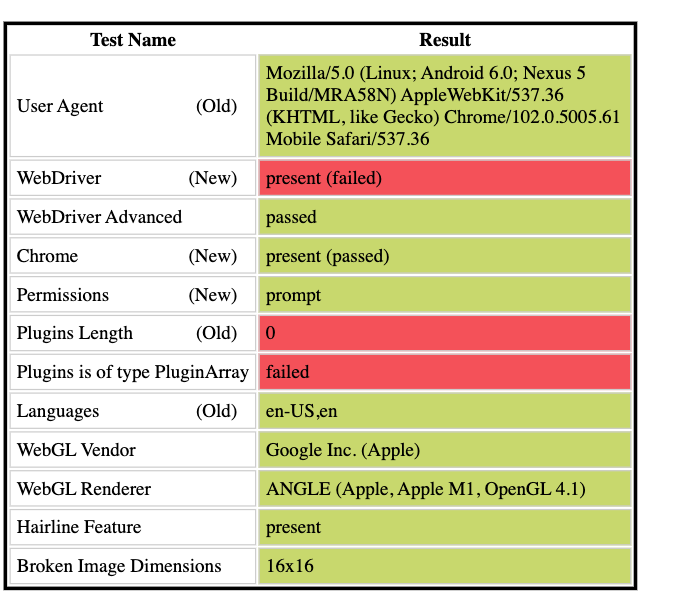
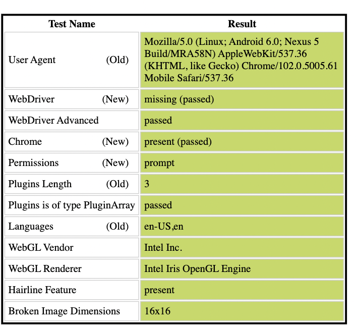

## stealth.min.js

selenium 过环境检测

```sh
npx extract-stealth-evasions
```

```python
with open('./stealth.min.js') as f:
    inject_js = f.read()

driver.execute_cdp_cmd("Page.addScriptToEvaluateOnNewDocument", {
  "source": inject_js 
})
```

### 效果

- 注入前



- 注入后



### 参考资料

- https://blog.csdn.net/weixin_42453905/article/details/122086184
- http://fengpiaoxus.com/blog/detail/3/
- https://github.com/berstend/puppeteer-extra/tree/master/packages/extract-stealth-evasions#readme
